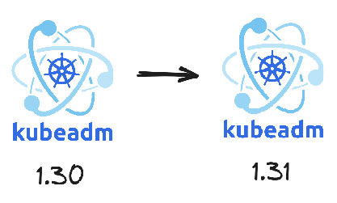

In this exercise, you will upgrade a multi-node Kubernetes cluster from version 1.30 to version 1.31. You'll need to follow the standard upgrade procedure while ensuring cluster stability throughout the process. Let's begin!



First, upgrade kubeadm on the control plane node:

::simple-task
---
:tasks: tasks
:name: verify_controlplane_kubeadm
---
#active
Checking control plane kubeadm version...

#completed
Great! Control plane kubeadm has been upgraded to version 1.31.
::

::hint-box
---
:summary: Hint 1
---
You'll need to unhold kubeadm first:
```bash
apt-mark unhold kubeadm
```
::


::hint-box
---
:summary: Hint 2
---
You also need to add version 1.31 to your sources list:
```bash
KUBERNETES_VERSION=1.31
mkdir -p /etc/apt/keyrings
curl -fsSL https://pkgs.k8s.io/core:/stable:/v$KUBERNETES_VERSION/deb/Release.key |  gpg --dearmor -o /etc/apt/keyrings/kubernetes-apt-keyring.gpg
echo "deb [signed-by=/etc/apt/keyrings/kubernetes-apt-keyring.gpg] https://pkgs.k8s.io/core:/stable:/v$KUBERNETES_VERSION/deb/ /" | tee /etc/apt/sources.list.d/kubernetes.list
```
After installing `kubeadm`, then verify with: `kubeadm version`
::

Next, upgrade the control plane:

::simple-task
---
:tasks: tasks
:name: verify_controlplane_upgrade
---
#active
Verifying control plane upgrade...

#completed
Excellent! The API server, controller manager, and scheduler are now running version 1.31.
::

::hint-box
---
:summary: Hint 3
---
1. Plan the upgrade:
```bash
kubeadm upgrade plan
```

2. Apply the upgrade
```bash
kubeadm upgrade apply v1.31.x
```

3. Verify the upgrade
```bash
kubectl get pods -n kube-system
```

Look for kube-apiserver, kube-controller-manager, and kube-scheduler pods
::

Next, upgrade the control plane components:

::simple-task
---
:tasks: tasks
:name: verify_controlplane_components
---
#active
Verifying control plane components upgrade...

#completed
Excellent! All control plane components are now running version 1.31.
::

::hint-box
---
:summary: Hint 4
---
1. Plan the upgrade:
```bash
kubeadm upgrade plan
```

2. Apply the upgrade:
```bash
kubeadm upgrade apply v1.31.x
```

3. Upgrade kubelet and kubectl:
```bash
apt-mark unhold kubelet kubectl
apt-get install -y kubelet=1.31.x-* kubectl=1.31.x-*
apt-mark hold kubelet kubectl
systemctl daemon-reload
systemctl restart kubelet
```
::

Now, upgrade kubeadm on the worker nodes:

::simple-task
---
:tasks: tasks
:name: verify_worker_kubeadm_node02
---
#active
Checking worker kubeadm versions on node-02...

#completed
Perfect! Worker node-02 kubeadm package has been upgraded.
::

::simple-task
---
:tasks: tasks
:name: verify_worker_kubeadm_node03
---
#active
Checking worker kubeadm versions on node-03...

#completed
Perfect! Worker node-03 kubeadm package has been upgraded.
::

::hint-box
---
:summary: Hint 5
---
On each worker node:
```bash
apt-mark unhold kubeadm
apt-get update && apt-get install -y kubeadm=1.31.x-*
apt-mark hold kubeadm
```
Then verify with: `kubeadm version`
::

Upgrade the worker node components on node02:

::simple-task
---
:tasks: tasks
:name: verify_worker_components_node02
---
#active
Verifying worker node-02 component versions...

#completed
Great! Worker node-02 components are now running version 1.31.
::

::hint-box
---
:summary: Hint 6
---
For each worker node:
1. Drain the node:
```bash
kubectl drain node-0x --ignore-daemonsets
```
2. Upgrade the node:
```bash
kubeadm upgrade node
```
3. Upgrade kubelet and kubectl:
```bash
apt-mark unhold kubelet kubectl
apt-get install -y kubelet=1.31.x-* kubectl=1.31.x-*
apt-mark hold kubelet kubectl
systemctl daemon-reload
systemctl restart kubelet
```
4. Uncordon the node:
```bash
kubectl uncordon node-0x
```
::


Upgrade the worker node components on node03:

::simple-task
---
:tasks: tasks
:name: verify_worker_components_node03
---
#active
Verifying worker node-03 component versions...

#completed
Great! Worker node-03 components are now running version 1.31.
::

::hint-box
---
:summary: Hint 7
---
For each worker node:
1. Drain the node:
```bash
kubectl drain node-0x --ignore-daemonsets
```
2. Upgrade the node:
```bash
kubeadm upgrade node
```
3. Upgrade kubelet and kubectl:
```bash
apt-mark unhold kubelet kubectl
apt-get install -y kubelet=1.31.x-* kubectl=1.31.x-*
apt-mark hold kubelet kubectl
systemctl daemon-reload
systemctl restart kubelet
```
4. Uncordon the node:
```bash
kubectl uncordon node-0x
```
::

Finally, verify the cluster is healthy:

::simple-task
---
:tasks: tasks
:name: verify_cluster_health
---
#active
Checking overall cluster health...

#completed
Congratulations! The cluster has been successfully upgraded and all components are healthy.
::

::hint-box
---
:summary: Hint 8
---
Verify cluster health with:
```bash
kubectl get nodes
kubectl get pods -A
kubectl get componentstatuses
```
Make sure all nodes are Ready and all pods are Running.
::
